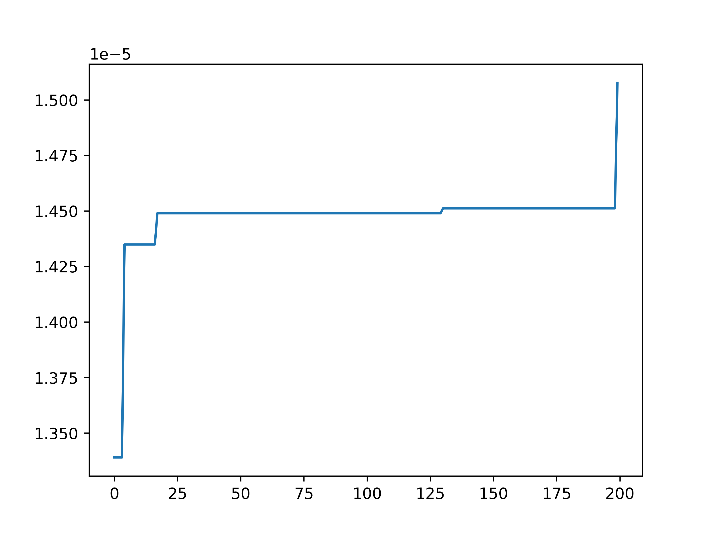
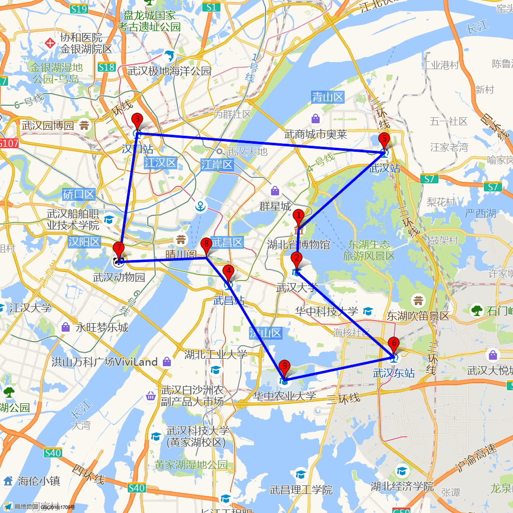

# 智能优化算法求解旅行商问题

### 问题背景
根据几个地名，计算出串连这几个地方的最短路径。

### 数学模型
使用遗传算法（GA）求解旅行商问题（TSP）

### 问题求解
为满足实际需要，调用高德地图API实现如下两个功能：
1. 根据地名进行搜索，返回该地的经纬度
2. 根据两地的经纬度，返回直线距离/驾车导航距离

根据上述各地之间的距离，实现遗传算法求解旅行商问题，在训练过程中，绘制历史最优适应度的变化曲线

求解完毕，调用高德地图API绘制路径的静态地图

### 环境依赖

1. matplotlib
2. pandas
3. numpy

### 存在的问题

1. 调用高德地图API绘制静态地图，最多支持10个地点标注

### 链接

高德地图API官方文档链接：
https://lbs.amap.com/api/webservice/guide/api/staticmaps
